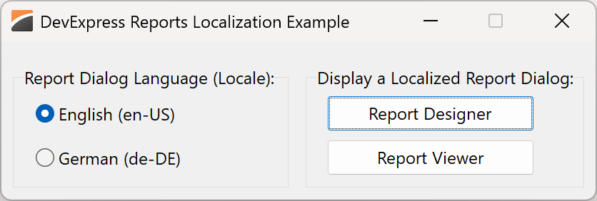
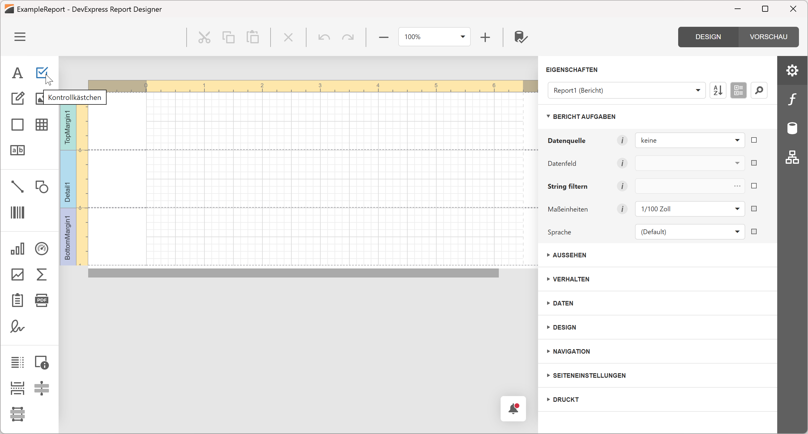
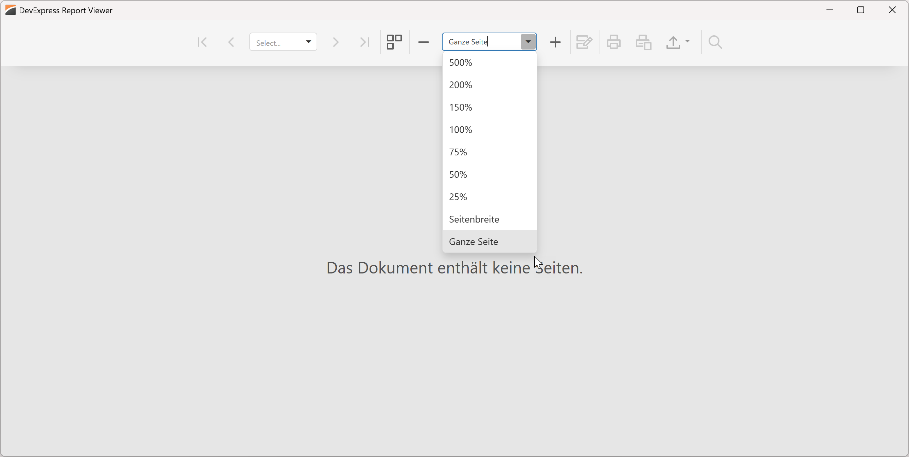

<!-- default badges list -->

[](https://supportcenter.devexpress.com/ticket/details/T1305951)
[](https://docs.devexpress.com/GeneralInformation/403183)
[](#does-this-example-address-your-development-requirementsobjectives)
<!-- default badges end -->

# DevExpress VCL Reports — Localize the DevExpress Report Viewer and Report Designer

This example localizes DevExpress VCL Reports components.

The [DevExpress Reporting Platform](https://docs.devexpress.com/VCL/405469/ExpressReports/vcl-reports) fully supports UI localization.
The localization example in this repository allows users to select between English (default) and German (localized) versions of two built-in DevExpress dialogs:
[Report Viewer](https://docs.devexpress.com/XtraReports/401850/web-reporting/web-document-viewer) and
[Report Designer](https://docs.devexpress.com/XtraReports/119176/web-reporting/web-end-user-report-designer).
The example includes projects for both [Delphi](./Delphi) and [C++Builder](./CPB).



## Prerequisites

See the [DevExpress Reports Prerequisites](
https://docs.devexpress.com/VCL/405773/ExpressCrossPlatformLibrary/vcl-backend/reports-dashboards-app-deployment#vcl-reportsdashboards-prerequisites).

## Implementation Details

To localize the DevExpress Report Designer and Report Viewer in your Delphi or C++Builder application,
you must:

1.  Use the [DevExpress UI Localization Service](https://docs.devexpress.com/GeneralInformation/16235/localization/localization-service)
    to obtain localization files for DevExpress VCL Report Viewer and Designer.
    These files contain UI string translations for specific languages/locales.
    Refer to the following guide to learn more:
    [Localize Core Reporting Components: Use JSON Files](https://docs.devexpress.com/XtraReports/400932/web-reporting/common-features/localization/localization-in-asp-net-core-reporting-applications#use-json-files).
1.  Extract downloaded files to a `Localization` folder next to your compiled application executable.
    Note that projects in this repository output their executables to the same location.
    This allows both projects to use the same localization files.
1.  Assign a language identifier (also known as [locale][1] or [culture identifier][2]) to the
    [`TdxReport.Language`](https://docs.devexpress.com/VCL/dxReport.TdxReport.Language)
    property to switch the Report Designer/Report Viewer to the desired language:

    **Delphi:**
    ```delphi
    dxReport1: TdxReport;
    
    // Switch Report UI to German 
    dxReport1.Language := 'de-DE'
    ```

    **C++Builder:**
    ```cpp
    TdxReport *dxReport1;

    // Switch Report UI to German
	dxReport1->Language = "de-DE";
    ```

[1]: https://learn.microsoft.com/en-us/globalization/reference/glossary#locale
[2]: https://learn.microsoft.com/en-us/dotnet/fundamentals/runtime-libraries/system-globalization-cultureinfo#culture-names-and-identifiers

For a step-by-step guide, refer to the following help topic:
[Report Viewer and Designer UI Localization](https://docs.devexpress.com/VCL/405598/ExpressReports/localization/vcl-report-viewer-and-designer-localization).

This example does not localize report content.
To localize report content in your project, refer to the following guide: [Report Localization](https://docs.devexpress.com/VCL/405599/ExpressReports/localization/vcl-report-localization).

The localization mechanism described in this example applies only to the DevExpress Report Designer and Report Viewer.
Other DevExpress VCL components support localization using [resource files and the Localizer Editor](https://docs.devexpress.com/VCL/154039/ExpressCrossPlatformLibrary/how-to/localize-an-application).

## Files to Review

-   [`Delphi/uMainForm.pas`](./Delphi/uMainForm.pas) loads an example report from `ExampleReport.repx`.
    Event handlers assigned to [`TcxRadioButton`](https://docs.devexpress.com/VCL/cxRadioGroup.TcxRadioButton)
    components switch localization language between English and German.
-   [`Localization/*.de.json`](./Localization/) files contain localized UI strings.

## Documentation

-   [VCL Report Viewer and Designer UI Localization](https://docs.devexpress.com/VCL/405598/ExpressReports/localization/vcl-report-viewer-and-designer-localization)
-   [VCL Reports Localization](https://docs.devexpress.com/VCL/405597/ExpressReports/vcl-reports-localization)
-   [DevExpress UI Localization Service](https://docs.devexpress.com/GeneralInformation/16235/localization/localization-service)
-   [TdxReport.Language Property](https://docs.devexpress.com/VCL/dxReport.TdxReport.Language)
-   [ExpressReports Application Deployment Requirements](https://docs.devexpress.com/VCL/405469/ExpressReports/vcl-reports#expressreports-app-deployment)

## Localized Report Dialogs Preview

**Localized Report Designer:**



**Localized Report Viewer:**



<!-- feedback -->
## Does This Example Address Your Development Requirements/Objectives?

[](https://www.devexpress.com/support/examples/survey.xml?utm_source=github&utm_campaign=vcl-reports-localize&~~~was_helpful=yes) [](https://www.devexpress.com/support/examples/survey.xml?utm_source=github&utm_campaign=vcl-reports-localize&~~~was_helpful=no)

(you will be redirected to DevExpress.com to submit your response)
<!-- feedback end -->
